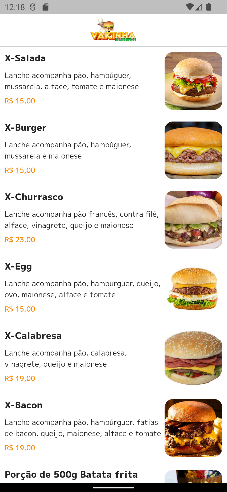

# DW9 Delivery App

Projeto criado durante a 9ª Dart Week da [Academia do Flutter](http://academiadoflutter.com.br/).
Onde foi desenvolvido um app de delivery usando o [Bloc](https://pub.dev/packages/bloc) no gerenciamento de estado, [Provider](https://pub.dev/packages/provider) para gerenciamento das dependências e outros packages. No backend foi criado um RESTful server baseado em JSON utilizado o pacote [Json Rest Server](https://pub.dev/packages/json_rest_server).

## Funcionalidades

- [x] Splash
- [x] Login
- [x] Register
- [x] Home (Lista dos produtos)
- [x] Product Detail (Mostra o produto selecionado na tela Home e permite adicionar no carrinho)
- [x] Order (Carrinho para conclusão do pedido)

## Screens

    
    
    
    
    
    
    
    

